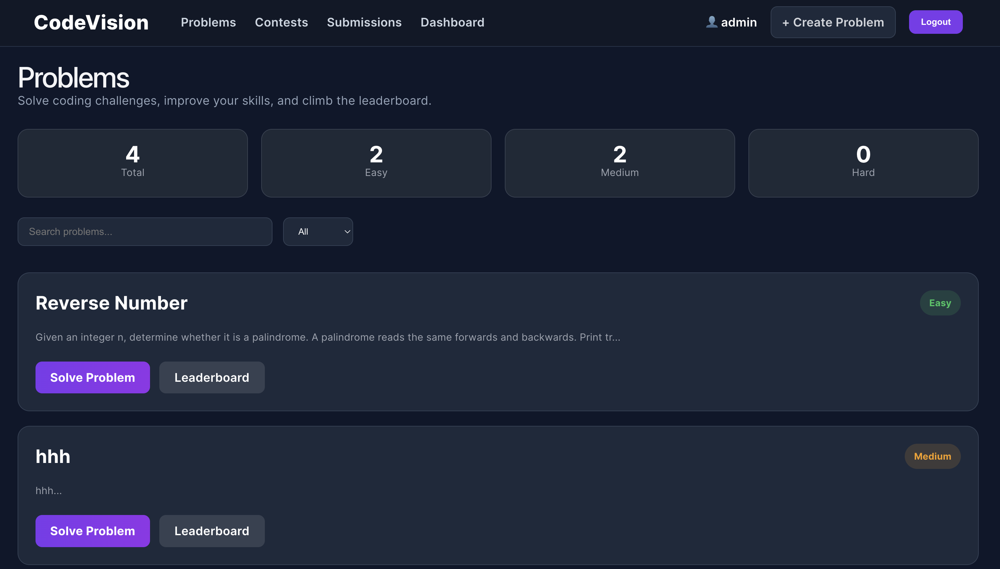
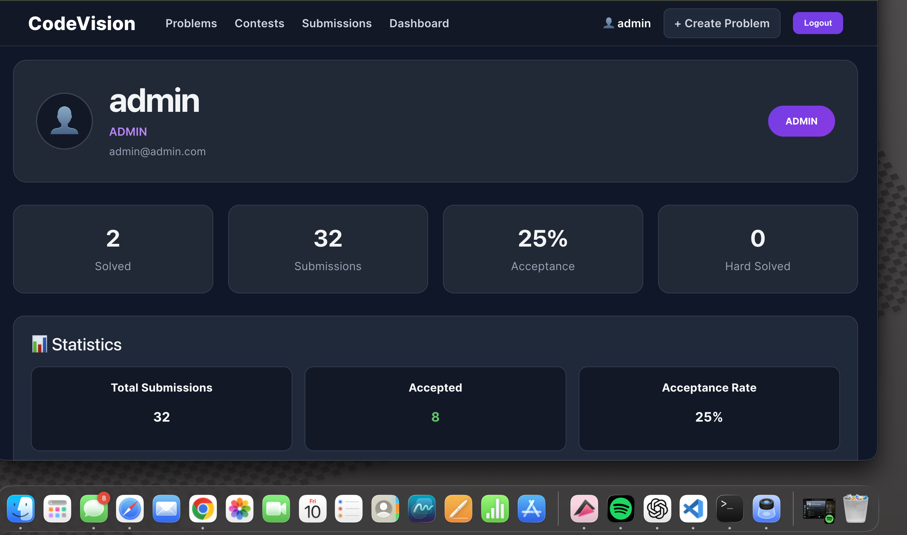
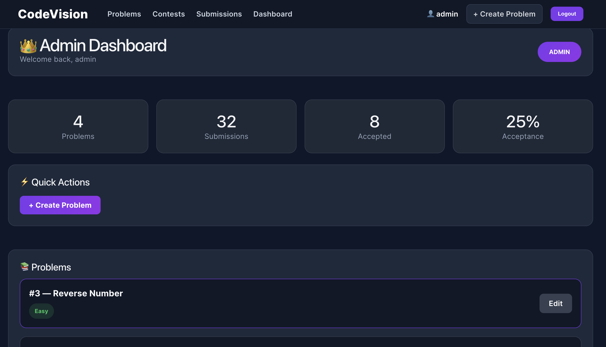

<p align="center">
  
</p>

<h1 align="center">CodeVision</h1>

> A full-stack coding challenge platform with multi-language container execution, automated submission feedback, contests, leaderboards, discussions, and role-based administration.

---

## 📖 Overview

CodeVision gives developers a focused environment for solving programming problems, testing solutions against visible and hidden cases, reviewing submission history, and competing on problem and contest leaderboards.

The project pairs a responsive React interface and Monaco editor with a secured Spring Boot REST API. PostgreSQL stores platform data, JWT bearer tokens protect account and submission workflows, and untrusted Java, Python, JavaScript, and C++ solutions run inside resource-limited Docker containers without network access.

---

## ✨ Features

### 💻 Coding Experience

- Searchable and Difficulty-Filtered Problem Catalog
- Monaco-Based Code Editor
- Java, Python, JavaScript, and C++ Templates
- Visible Samples and Hidden Evaluation Cases
- Isolated Docker Code Execution
- Compilation, Runtime, Timeout, and Wrong-Answer Detection
- Automated Status-Aware Submission Feedback
- Personal Attempt and Submission History

### 🏆 Competition and Community

- Scheduled Coding Contests
- Contest Problem Collections
- Per-Problem Runtime Leaderboards
- Contest Rankings by Solved Problems and Best Runtime
- Problem Statistics and Acceptance Rates
- Authenticated Problem Discussions

### 👤 Accounts and Progress

- User Registration and Login
- JWT Bearer Authentication
- BCrypt Password Hashing
- Protected Account and Submission Routes
- Profile Statistics by Difficulty
- Solved-Problem Tracking
- Achievement Badges

### 🎨 User Experience

- Responsive Desktop and Mobile Layouts
- Active Navigation States
- Loading, Empty, Error, and Success Feedback
- Accessible Form Labels and Keyboard Focus Styles
- Human-Readable Dates and Submission Statuses

### 🛡 Administration and Safety

- Role-Based Problem and Test-Case Management
- Public and Hidden Test Cases
- Contest Management API
- Server-Side Request Validation
- Structured API Error Responses
- Configurable CORS, Database, and JWT Settings
- Read-Only, Network-Isolated Execution Containers
- CPU, Memory, Process, Output, and Time Limits
- GitHub Actions Backend and Frontend Checks

---

## 🛠 Tech Stack

### Frontend

- React 19
- React Router
- Vite
- Monaco Editor
- CSS3
- ESLint

### Backend

- Java 17
- Spring Boot 4
- Spring Security
- Spring Data JPA
- Hibernate
- JWT
- Maven

### Data and Execution

- PostgreSQL 17
- H2 for Integration Tests
- Docker
- Eclipse Temurin, Python, Node.js, and GCC Runtime Images

### Testing

- JUnit
- MockMvc
- Mockito
- Spring Security Test
- GitHub Actions

---

## 🏗 Architecture

```text
                       React / Vite Client
                    Monaco Editor + Router
                               │
                     JWT-authenticated REST
                               │
                               ▼
                      Spring Boot API
                 Security + Validation + JPA
                               │
              ┌────────────────┴────────────────┐
              │                                 │
              ▼                                 ▼
      PostgreSQL Database              Docker Execution
   Users, Problems, Contests       Network-disabled sandboxes
    Tests, and Submissions        CPU / memory / time limits
```

The API is the source of truth for authorization, contest membership, hidden tests, evaluation results, and leaderboard calculations. Regular users never receive hidden test cases, and standard accounts cannot access administrative endpoints.

---

## 🔍 Engineering Highlights

- Execution results keep process status separate from program output, preventing valid output text from being mistaken for a runtime or compilation failure.
- Every execution receives an isolated, read-only container with networking disabled and bounded CPU, memory, processes, output, and wall-clock time.
- JWT authentication is stateless, role checks are enforced at the API boundary, and unauthorized or malformed requests receive consistent JSON errors.
- Contest submissions are accepted only during the scheduled window and only for problems assigned to that contest.
- Leaderboards retain each user’s best accepted runtime per problem, while contest rankings prioritize solved problems before cumulative runtime.
- Integration and unit tests cover authentication, validation, authorization, hidden test protection, and judge-status regression cases.

---

## 🖼 Interface

<table>
  <tr>
    <td></td>
    <td></td>
  </tr>
  <tr>
    <td></td>
    <td></td>
  </tr>
</table>

---

## 📂 Project Structure

```text
CodeVision
│
├── backend
│   ├── src/main/java/com/codevision/backend
│   │   ├── config
│   │   ├── controller
│   │   ├── dto
│   │   ├── entity
│   │   ├── exception
│   │   ├── repository
│   │   └── service
│   ├── src/test
│   └── pom.xml
│
├── frontend
│   ├── public/brand
│   ├── src
│   │   ├── components
│   │   ├── pages
│   │   ├── services
│   │   └── utils
│   └── package.json
│
├── docs/Screenshots
├── .github/workflows/ci.yml
├── compose.yaml
└── README.md
```

---

## ⚙️ Local Installation

### Prerequisites

- Java 17
- Node.js 20 or newer
- Docker Desktop
- Git

### Clone the Repository

```bash
git clone https://github.com/SinghSampreet04/CodeVision.git
cd CodeVision
cp .env.example .env
```

### Start PostgreSQL

```bash
docker compose up -d database
```

The included container creates the `codevision` database on host port `5434`, avoiding the default PostgreSQL port commonly used by local installations.

### Prepare Execution Images

```bash
docker pull eclipse-temurin:21
docker pull python:3.12
docker pull node:22
docker pull gcc:14
```

Pre-pulling keeps the first code submission from spending its execution window downloading a runtime.

### Run the Backend

```bash
cd backend
./mvnw spring-boot:run
```

Backend API:

```text
http://localhost:8081
```

The local defaults match `compose.yaml`. Other environments can set:

```text
DATABASE_URL
DATABASE_USERNAME
DATABASE_PASSWORD
JWT_SECRET
JWT_EXPIRATION_MS
CORS_ALLOWED_ORIGIN
SERVER_PORT
```

Use a private random `JWT_SECRET` of at least 32 bytes outside local development.

### Run the Frontend

Open another terminal:

```bash
cd frontend
cp .env.example .env
npm ci
npm run dev
```

Frontend:

```text
http://localhost:5173
```

Set `VITE_API_URL` when the backend is hosted at another origin.

---

## 🔌 API Endpoints

### Authentication and Profile

```text
POST   /auth/register
POST   /auth/login
GET    /users/profile
GET    /users
POST   /users
GET    /health
```

### Problems, Tests, and Discussions

```text
GET    /problems
GET    /problems/{id}
POST   /problems
PUT    /problems/{id}
DELETE /problems/{id}
GET    /testcases/problem/{problemId}
POST   /testcases
PUT    /testcases/{id}
DELETE /testcases/{id}
GET    /discussions/problem/{problemId}
POST   /discussions
```

### Submissions and Rankings

```text
POST   /submissions
GET    /submissions/me
GET    /submissions/me/problem/{problemId}
GET    /submissions/{id}
GET    /submissions/stats/problem/{problemId}
GET    /submissions/leaderboard/problem/{problemId}
POST   /execute
```

### Contests

```text
GET    /contests
GET    /contests/{id}
GET    /contests/{id}/leaderboard
POST   /contests
PUT    /contests/{id}
DELETE /contests/{id}
POST   /contests/{contestId}/problems/{problemId}
```

Protected endpoints require:

```text
Authorization: Bearer <token>
```

Problem, test-case, contest, and user administration endpoints require the `ADMIN` role.

---

## 🧪 Testing

Run the backend integration suite:

```bash
cd backend
./mvnw test
```

Run the frontend quality checks and production build:

```bash
cd frontend
npm run check
```

The backend suite runs against an isolated H2 database and verifies registration, login, JWT profile access, structured errors, role enforcement, hidden test-case protection, and execution-status classification.

---

## 👨‍💻 Author

**Sampreet Singh**

GitHub: [SinghSampreet04](https://github.com/SinghSampreet04)

---

## ⭐ Support

If you find this project useful, consider giving the repository a star.
